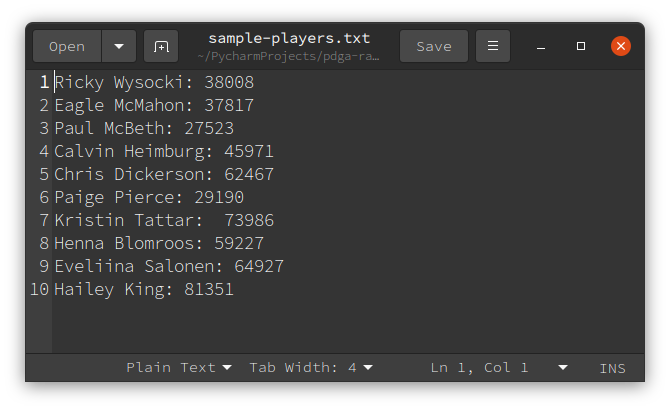
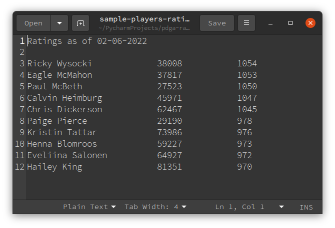

A tool to retrieve the player ratings of any number of tournament disc golfers

### Introduction

Player ratings are calculated by the [Professional Disc Golf Association](https://www.pdga.com) using tournament scores.
The precise algorithm is proprietary but likely involves weighted averaging of individual round ratings that are obtained by linear regression.

The utility of this repo is the ability to simultaneously gather ratings (generally in the vicinity of a rating update) without having to visit invidual URL's.
The use case for which this software was designed involved selecting a team of disc golfers based on highest rating.

### Method
For an input list of player names and numbers, use the `requests` and `BeautifulSoup` modules in Python to web scrape data and save into a text file.

#### Input

A text file in which each row is of the form:  

`[PLAYER_NAME]: [PDGA_NUMBER]`  

The file must be located same file as the other scripts. 
A sample input file is shown below and also included in this repo (`sample-players.txt`).  If desired, it may be altered to the players of interest.

{ width=50% height=50% }

#### Output
A text file where each row has columns of player name, player PDGA numbers, and current playing rating.
If the person of interest is not an active PDGA member (i.e. their registration has lapsed), a value of `EXPIRED` is assigned.
An example of typical output is also included (`sample-players-ratings-02-06-2022.txt`) and also displayed below.
The output file may be given an arbitrary name but a default name is generated for convenience.

{ width=50% height=50% }

